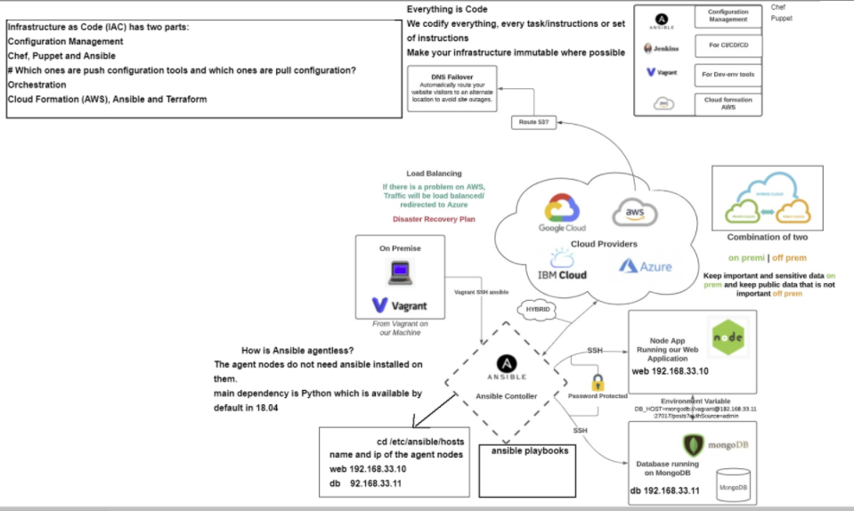

# Ansible controller and agent nodes set up guide

- Clone this repo and run `vagrant up`
- `(double check syntax/intendation)`

## We will use 18.04 ubuntu for ansible controller and agent nodes set up 
### Please ensure to refer back to your vagrant documentation

- **You may need to reinstall plugins or dependencies required depending on the OS you are using.**

```vagrant 
# -*- mode: ruby -*-
# vi: set ft=ruby :

# All Vagrant configuration is done below. The "2" in Vagrant.configure
# configures the configuration version (we support older styles for
# backwards compatibility). Please don't change it unless you know what

# MULTI SERVER/VMs environment 
#
Vagrant.configure("2") do |config|

# creating first VM called web  
  config.vm.define "web" do |web|
    
    web.vm.box = "bento/ubuntu-18.04"
   # downloading ubuntu 18.04 image

    web.vm.hostname = 'web'
    # assigning host name to the VM
    
    web.vm.network :private_network, ip: "192.168.33.10"
    #   assigning private IP
    
    config.hostsupdater.aliases = ["development.web"]
    # creating a link called development.web so we can access web page with this link instread of an IP   
        
  end
  
# creating second VM called db
  config.vm.define "db" do |db|
    
    db.vm.box = "bento/ubuntu-18.04"
    
    db.vm.hostname = 'db'
    
    db.vm.network :private_network, ip: "192.168.33.11"
    
    config.hostsupdater.aliases = ["development.db"]     
  end

 # creating are Ansible controller
  config.vm.define "controller" do |controller|
    
    controller.vm.box = "bento/ubuntu-18.04"
    
    controller.vm.hostname = 'controller'
    
    controller.vm.network :private_network, ip: "192.168.33.12"
    
    config.hostsupdater.aliases = ["development.controller"] 
    
  end

end
```
## ssh into three VMs & Run sudo apt-get update on all three virtual machines
```python
vagrant ssh controller
sudo apt-get update
```
`vagrant ssh web`
`sudo apt-get update`

`vagrant ssh db`
`sudo apt-get update`

## Controller Machine (ansible)

```python
vagrant ssh controller

sudo apt-get update
  
sudo apt-get install software-properties-common
  
sudo apt-add-repository ppa:ansible/ansible
  
sudo apt-get update
  
sudo apt-get install ansible

cd /etc/ansible
```
check to see if ansible is installed via `ansible --version`

### Setting Connections to DB and Web

- To connect our DB and Web we need to enter the hosts file and change the configuration.
- We know that our web virtual machine has an IP of 192.168.33.10.
- We know that our db virtual machine has an Ip of 192.168.33.11.
- We go into hosts and enter the following.

## SSH into web & db from the controller
```python
vagrant@controller:/etc/ansible$ ssh vagrant@192.168.33.10
enter 'yes' & password: vagrant
logout of web
vagrant@controller:/etc/ansible$ ssh vagrant@192.168.33.11
enter 'yes' & password: vagrant
logout of db
```
## Add ip addresses of the web and db into controller hosts

`sudo nano hosts`

```hosts
[web]
192.168.33.10 ansible_connection=ssh ansible_ssh_user=vagrant ansible_ssh_pass=vagrant

[db]
192.168.33.11 ansible_connection=ssh ansible_ssh_user=vagrant ansible_ssh_pass=vagrant

```
- To check if we can successfully connect to our VM's we should ping them via the command.
```
ping 192.168.33.10
ping 192.168.33.11
#all the servers
ansible all -m ping
# or separately each server
ansible web -m ping
ansible app -m ping
```
## Ansible ad hoc commands
- We can also determine the names of the machines via the command `ansible all -a "uname -a"` or individually via `ansible NAME_IN_HOSTS -a "uname -a"`
- Other command include `ansible all -a "free -m"` to see memory.
- `ansible all -a "date"` to see the date.
[ref: ansible documentation](https://docs.ansible.com/ansible/latest/user_guide/intro_adhoc.html)

### Playbooks

-  playbook is a blueprint of automation tasks. Ansible playbooks are executed on a set, group, or classification of hosts, which together make up an Ansible inventory.
- We can install nginx and nodejs on the web server by creating a playbook known as `nginx_playbook.yml`
- we than input the following.

```python
# This is a playbook to install and set up nginx in our web server where the ip is 198.162.33.10.
# playbook is written in YAML and starts with three ---.
---
# name of the hosts -hosts is to define the name of hosts or all

- hosts: web

# find facts about the hosts

  gather_facts: yes

# we need admin access

  become: true

# instructions using module in ansible

  tasks: 
  - name: Install Nginx

# install nginx
    apt: pkg=nginx state=present update_cache=yes

# ensure nginx is active
    notify:
     - restart nginx
  - name: Allow all access to tcp port 80
    ufw:
       rule: Allow
       port: '80'
       proto: tcp

  handlers:
    - name: Restart Nginx
      service:
        name:nginx
        state: restarted
```

# update cache
# restart nginx if reverse proxy is implemented or if needed
- hosts: web
  gather_facts: yes
  become: true

  tasks:
    - name: "Add nodejs apt key"
      apt_key:
        url: https://deb.nodesource.com/gpgkey/nodesource.gpg.key
        state: present

```
  
- This will install the nodejs and nginx dependencies on the web virtual machines. 
- We can check this via ` ansible web -m shell "systemctl status nginx"` which should show it as active and running.
